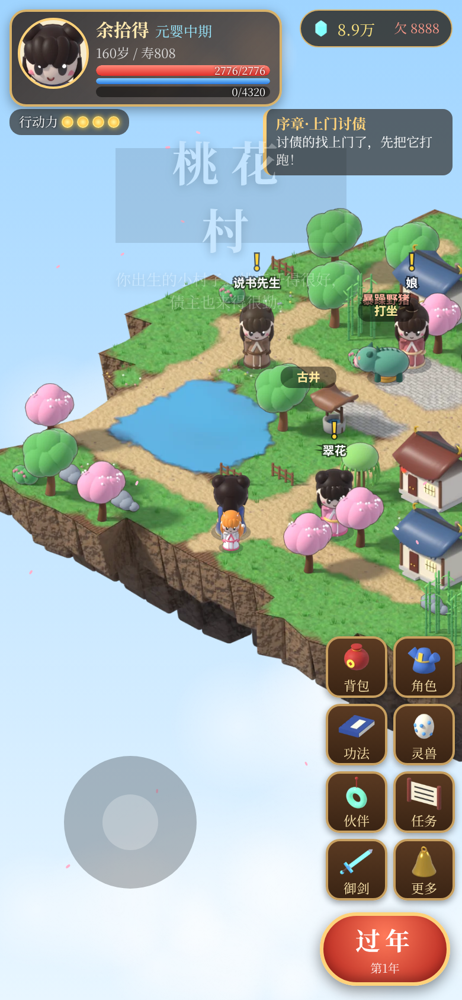
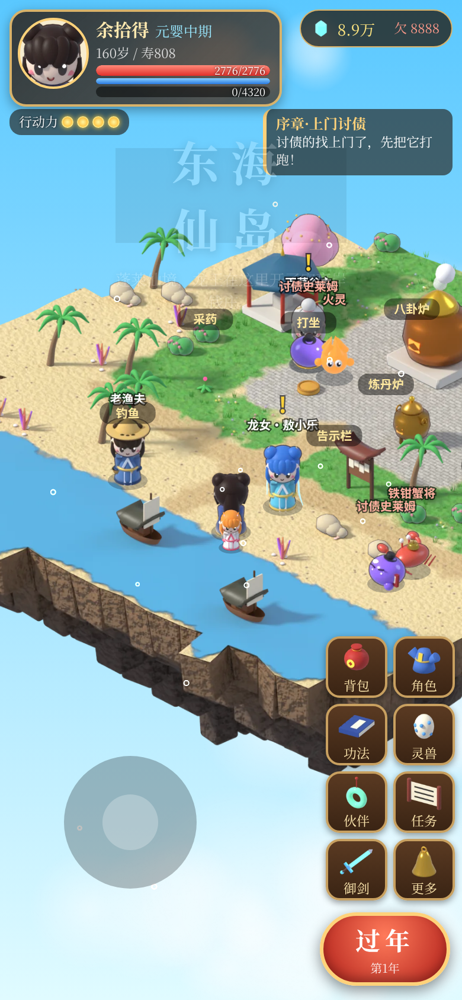
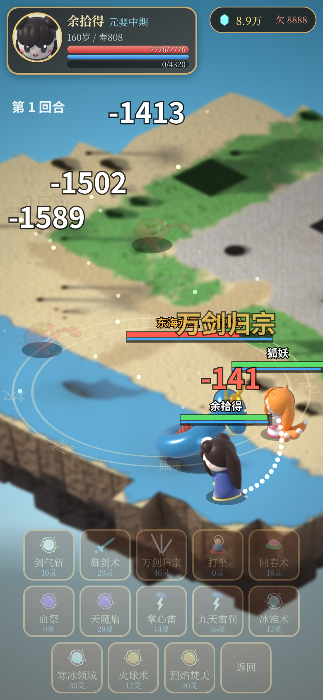
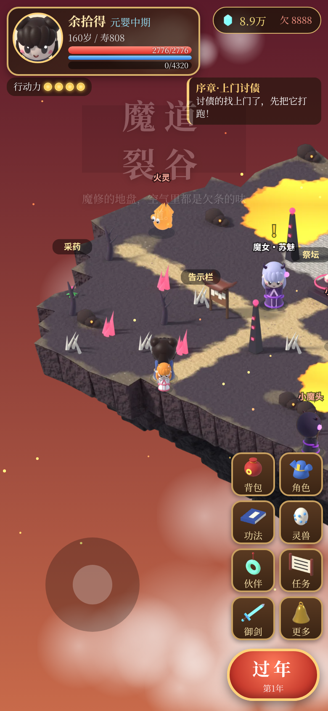
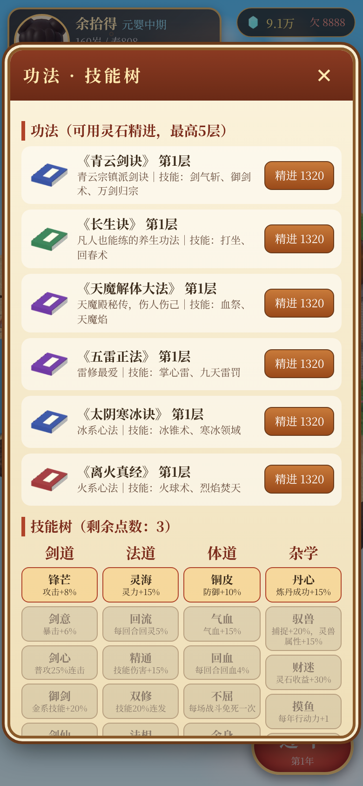
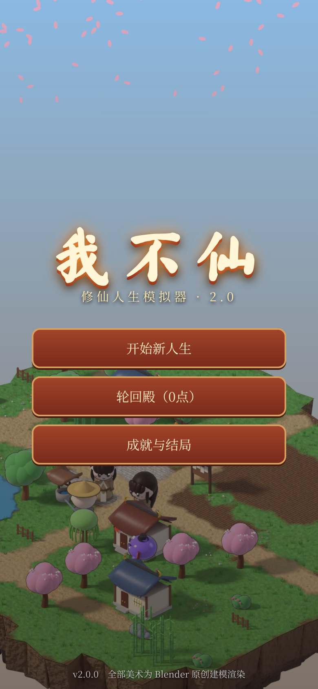

# 我不仙 2.0 · 修仙人生模拟器

> 从凡人开始，欠天道一个飞升。

一款 **2.5D 等距视角 · Q 版国风** 的修仙人生模拟器（安卓 APK）。
2.0 版本全面重做：**所有角色、怪物、BOSS、建筑、道具都在 Blender 中真实 3D 建模**，离线渲染成 8 方向精灵和等距地图；
主角可以在 8 张大地图上 **自由行走**（点地寻路 / 虚拟摇杆），和 NPC 对话、采药开宝箱、遭遇巡逻妖怪进入回合制斗法。
人生模拟的核心循环保留：抽天赋、摸灵根、一年一年长大，**凡人 → 练气 → 筑基 → 金丹 → 元婴 → 化神 → 渡劫 → 飞升**，寿尽身死后进入轮回殿再来一世。

落魄剑仙（出自 MV《我不仙》）以“师父”身份登场——主要是来借钱的。主线剧情：一路查清 **“天道尾款”** 的真相，在天外天与天道当面对账。

全部美术由本仓库中的 bpy 脚本程序化建模渲染，全部 BGM/音效由 numpy 程序化合成，**无任何外部/版权素材**，完全离线运行。

| | | |
|---|---|---|
|  |  |  |
|  |  |  |

## 2.0 新内容

- **3D 建模美术**（Blender 4.2，Cycles 渲染）
  - Q 版主角：男/女 × 4 档服装（布衣 → 宗门道袍 → 法袍 → 仙袍），随境界换装
  - 落魄剑仙、村长、娘亲、掌门长老、丹师、商人、龙女、魔女等 NPC
  - 12 种怪物（讨债史莱姆、暴躁野猪、讨债鬼、纸符小鬼、石头精、狐妖、火灵、树妖、铁钳蟹将、游魂、僵尸、小魔头）
  - 4 个 BOSS（尸王·欠一世、东海龙王·敖铁公、魔尊·赊刀人、讨尾款的天道）
  - 65 种建筑与道具（民居、宗门大殿、丹炉、牌坊、宝箱、灵草、船、南天门……）、飞剑
  - 5 方向渲染 + 镜像 = **8 方向** 待机/行走/攻击动画，打包为 webp 图集
  - 8 张等距浮空岛地图底板（软阴影、悬崖、水面/岩浆），37 张 3D 头像，67 个物品/技能图标
- **可行走大地图**：A* 8 向寻路、虚拟摇杆、深度排序与遮挡半透明、环境粒子（桃花、落叶、灯笼、萤火、气泡、余烬、仙光）
- **问道式回合制斗法**：敌我分列，攻击/技能/道具/防御/捕捉/逃跑/自动，五行克制、暴击、技能特效（剑气、火球、冰锥、雷罚、万剑归宗……）
- **内容**：8 张地图、153 个人生事件、3 大宗门、12 部功法 + 4 系技能树、装备与法宝（5 档稀有度：凡/灵/宝/仙/神品 + 随机词缀）、炼丹（火候小游戏）、钓鱼、灵兽捕捉与培养、伙伴与道侣、16 个支线任务 + 10 段主线、30 个成就、9 种结局、轮回殿永久强化、长期闭关
- **原创音乐**：11 首五声音阶 BGM（每张地图一首 + 战斗/BOSS/标题），18 个音效

## 怎么玩

| 操作 | 说明 |
| --- | --- |
| **投胎** | 起名选性别 → 6 选 3 天赋（可刷新）→ 分配先天属性 → 摸骨测灵根 |
| **移动** | 点击地面自动寻路，或用左下角摇杆；点击 NPC 对话，点击发光物件互动，碰到妖怪进入斗法 |
| **行动力** | 每年有若干行动力：采药、打坐、练剑、钓鱼、御剑飞往其他地图都会消耗 |
| **过年** | 右下角“过年”进入下一年：获得修为、触发人生事件、商店进货 |
| **突破** | 修为满后点“突破”，金丹以上要渡 **天劫**；筑基后可在蒲团上长期闭关（10/30/50/100 年） |
| **斗法** | 回合制，选择技能后点选目标；“自动”托管 |
| **轮回** | 寿元耗尽或身死道消后结算轮回点，在轮回殿永久强化下一世 |

进度自动保存在本地；安卓返回键 = 关闭弹窗。

## 文件结构

```
www/                 游戏（HTML5 Canvas + 原生 JS，无第三方依赖）
  js/engine.js       2.5D 渲染：地图底板、精灵 8 方向、深度排序、寻路、摇杆、粒子
  js/battle.js       回合制斗法与技能特效
  js/game.js         人生模拟：成长、修为、突破/天劫、事件、任务、地图、轮回
  js/talk.js         NPC 对话、商店、宗门、道侣、BOSS 剧情、地图互动点
  js/ui.js           HUD、背包/角色/功法/灵兽/任务/御剑面板、炼丹、钓鱼、结局、轮回殿
  js/data.js         数值与内容表；js/events.js 153 个事件
  assets/            打包后的 webp 图集、地图、头像、图标、ogg 音频与 assets.js 元数据
art/                 Blender bpy 建模与渲染脚本（lib/chars/monsters/props/specs/mapdefs/render_*.py）
  render_all.sh      全部离线渲染流水线（渲染产物 art/out 与 .blend 不进 git）
tools/build_assets.py  把渲染结果打包成 webp 图集 + assets.js
tools/audio/synth.py   程序化合成 BGM/音效
android/             Android WebView 外壳工程（Gradle 8.9 / AGP 8.7.3）
wobuxian.apk         安装包（2.0.0，versionCode 2）
test/                Playwright 自动化：smoke2.py / fulllife.py（机器人完整一生）/ shots2.py（截图）
```

## 构建

环境：JDK 17、Android SDK（android-35、build-tools 35.0.0）、Gradle 8.9、Python 3（Pillow、numpy）。

```bash
./build.sh            # 用 www/ 现有资源打包 APK → wobuxian.apk
# 重新生成全部美术（需 Blender 4.2，CPU 渲染数小时）：
BLENDER=/path/to/blender art/render_all.sh && ./build.sh
```

本地调试：浏览器直接打开 `www/index.html`，手机竖屏尺寸（如 390×844）效果最佳。

## 测试

```bash
pip install playwright
python3 test/smoke2.py 120     # 创建角色 + 机器人自动玩 120 秒，输出 JS 错误
python3 test/fulllife.py 2400  # 机器人完整玩一生直到轮回殿
python3 test/shots2.py         # 8 张地图、战斗、各面板截图
```

v1.0（纯 Canvas 绘制版）保留在 git 历史中（commit 8485cd6）。
